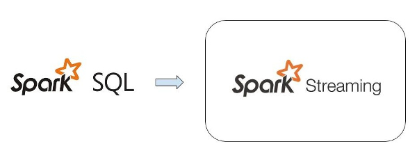
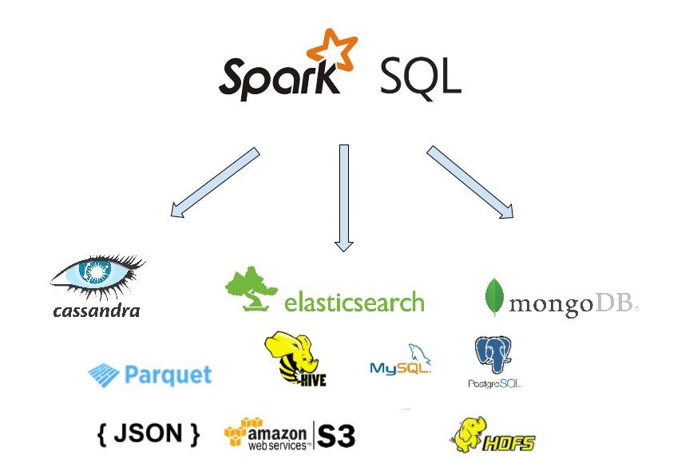
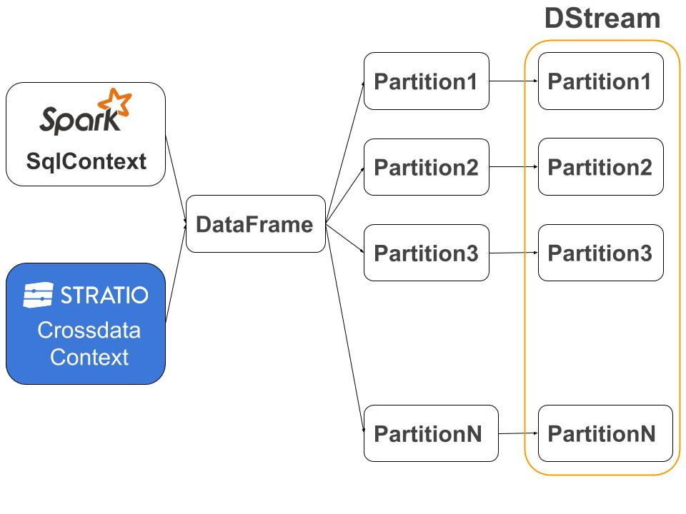
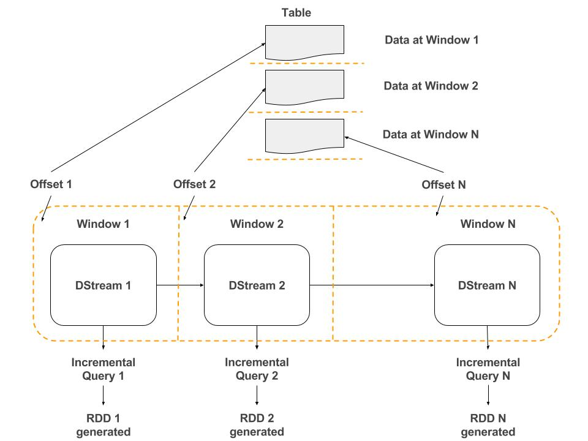

# Datasource-Receiver

Datasource-Receiver is a library that allows the user to read data with [SparkSQL](http://spark.apache.org/docs/latest/sql-programming-guide.html)
from Datasources and then insert the data in [Spark Streaming](http://spark.apache.org/docs/latest/streaming-programming-guide.html)


## Requirements

This library requires Spark 1.5+, Scala 2.10+

## Using the library

There are two ways of using Datasource-Receiver library:

The first one is to add the next dependency in your pom.xml:

  ```
  <dependency>
    <groupId>com.stratio.receiver</groupId>
    <artifactId>datasource</artifactId>
    <version>LATEST</version>
  </dependency>
  ```

The other one is to clone the full repository and build the project:

  ```
  git clone https://github.com/Stratio/Datasource-Receiver.git
  mvn clean install
  ```

The basic idea is receive data in Spark Streaming with Spark Sql:

          
 
Some use cases is monitoring tables, migrating data, generate streaming data from batch data...
The use of SparkSQL have the advantage that the library is polyglot and can read data from multiple databases, like 
JDBC, Cassandra, ElasticSearch, MongoDB ... The user must add the java jar with the connector library and then is 
possible to use it in the initial query. Per example:
 
 - Reading data from MongoDB with the Stratio Library:
 
 ```
 CREATE TEMPORARY TABLE tableName USING com.stratio.datasource.mongodb OPTIONS (host 'localhost', database 'sparta', collection 'streamtrigger'
 InputSentences("select * from tableName") 
 ```

          

### Distributed Approach with SparkSQL

The distributed approach is based in SparkSQL, on each streaming window the receiver execute one query with SparkSQL 
and generate one DataFrame and the partitions of this DataFrame corresponds with the DStream partitions.

    

With the receiver is possible to monitoring tables in the datasources, the user specify one offset field and on each 
window the offset is updated to generate the new incremental query.
 
  
 
The receiver have implemented one Object for specify the offset options, limit the results and generate stop 
conditions. One example:

   ```
   InputSentences(
         query = "select * from tableName",
         offsetConditions = OffsetConditions(OffsetField("followersCount")),
         stopConditions = StopConditions(true, true),
         initialStatements = Seq("CREATE TEMPORARY TABLE tableName USING com.stratio.datasource.mongodb OPTIONS (host 'localhost', database 'sparta', collection 'streamtrigger')")
   )
   ```


### Build

There are two modules to package with different versions of Spark

- To package it with Spark-1.5:

    `mvn clean package -pl com.stratio.receiver:spark-datasource_1.5`

- To package it with Spark-1.6 (default):

    `mvn clean package -pl com.stratio.receiver:spark-datasource_1.6`


### Scala API

- Implicitly use SparkSQLContext
    
    ```
    val receiverStream = DatasourceUtils.createStream(sparkStreamingContext, inputSentences, datasourceParams)
    ```
    
- Using a generic Context
    
    ```
    val receiverStream = DatasourceUtils.createStream(sparkStreamingContext, inputSentences, datasourceParams, sqlContext)
    ```


### Java API

- Implicitly use SparkSQLContext

  ```
  JavaReceiverInputDStream receiverStream = DatasourceUtils.createJavaStream(javaSparkStreamingContext, inputSentences datasourceParams);
  ```
  
- Using a generic Context

  ```
  JavaReceiverInputDStream receiverStream = DatasourceUtils.createJavaStream(javaSparkStreamingContext, inputSentences datasourceParams, sqlContext);
  ```
  

### Spark Parameters Options 

| Parameter                 | Description                             | Optional                             |
|---------------------------|-----------------------------------------|--------------------------------------|
| stopGracefully            | Stop Streaming Context gracefully       | Yes  (default: true)                 |
| stopSparkContext          | Stop SparkContext when stop Streaming   | Yes  (default: false)                |
| storageLevel              | Max time to receive messages            | Yes  (default: MEMORY_ONLY)          |
| rememberDuration          | Remember duration for Spark Dstreams    | Yes  (default: 60s)                  |


# License #

Licensed to STRATIO (C) under one or more contributor license agreements.
See the NOTICE file distributed with this work for additional information
regarding copyright ownership.  The STRATIO (C) licenses this file
to you under the Apache License, Version 2.0 (the
"License"); you may not use this file except in compliance
with the License.  You may obtain a copy of the License at

  http://www.apache.org/licenses/LICENSE-2.0

Unless required by applicable law or agreed to in writing,
software distributed under the License is distributed on an
"AS IS" BASIS, WITHOUT WARRANTIES OR CONDITIONS OF ANY
KIND, either express or implied.  See the License for the
specific language governing permissions and limitations
under the License.
